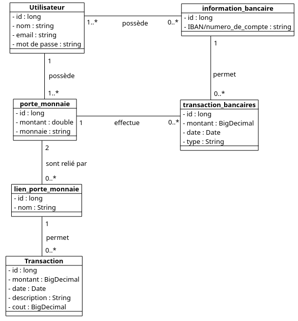
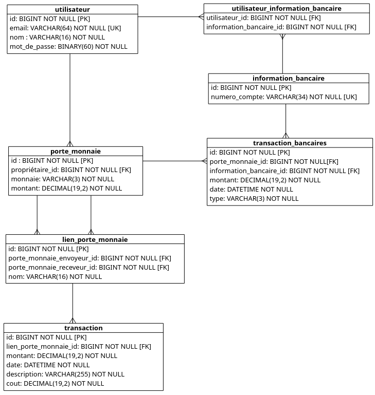

# Pay My Buddy Transfer

Simple application to transfer money between persons.

## Description

This application was made for an OpenClassrooms formation. Its goal is to allow the fast and easy transfer of money between users, and to allow users to easely add to or withdraw money from the application.




## Getting Started

### Dependencies

* A Java development kit version 17
* Maven 3.8.3
* MariaDB 10.6.5
* Git 2.34.1

### Installing

* Clone the git repository at the address :
    https://github.com/Kafeinedev/paymybuddy_transfer
* Open a connection to your database manager and create a database named "test".
then type the command
```
    source PathToTheClonedRepository/src/main/resources/database.sql;
```
* In the directory of the cloned repository execute the command :
```
    mvn package
```
* Move the jar file created in the target directory to the root of the cloned repository

### Executing program

* In the repository folder run the following command:
```
    java -jar paymybuddy-0.0.1-SNAPSHOT.jar
```
* To access the application use your browser to connect to localhost/8080
* You can login using one of the prepopulated user :\
email : cash@man.com password : Meg@rich1337\
email : bank@forbucks.com password : PognonP@rt0ut\
email : pas@pauvre.com password : Simp@PortM0nnaie

## Version History

* First prototype.
